# Design Patterns for Healthcare Software Engineers - implemented in Java

## Creational
Creational – deals with the process of creation of objects of classes.

## Abstract Factory
Abstract Factory patterns work around a super-factory (MedicationFactory) which creates other factories.
This factory is also called as factory of factories.
Provides and interface for creating of families of related or dependent object without specifying they concrete classes Unlike factory method pattern which constructs single object

In Abstract Factory pattern an interface is responsible for creating a factory of related objects without explicitly specifying their classes. Each generated factory can give the objects as per the Factory pattern.

If we want to add new class like: Advil we don’t have to update MedicationFactory method just simply create new AdvilFactory class which will implement AbstractMedicationFactory() and return Advil class instance so AbstractMedicationFactory works as Polymorphic type here.

Advantage of: Abstract Factory over Factory Method
-	Provides abstraction for Factories when Factory method provides abstraction for concrete classes
-	Extra layer of abstraction
-	don’t require updating and maintenance when our classes grow
-	No if/else or switch statement
-	Loosely coupled code
-	Easy to extend when more classes added

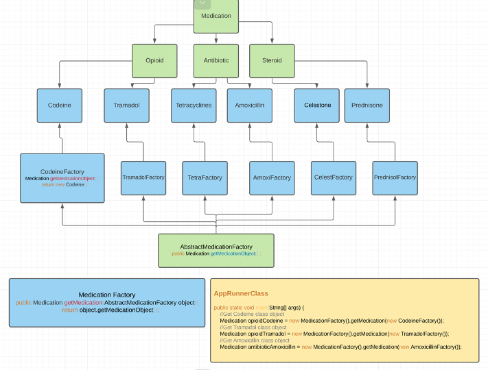

## Factory Method pattern vs Abstract Factory

Factory Method- Uses Factory design pattern when you want to define the class of an object at runtime.
It also allows you to encapsulate object creation so that you can keep all object creation code in one place.

Example: When creating new Provider User provides Provider type at runtime
You might see some implementation of Factory method where creation defined as a static method.
Benefits of this approach is - you do not need to instantiate an object to make use of the create method. 
But this approach also has disadvantages - you can't subclass and change the behaviour of create method. 

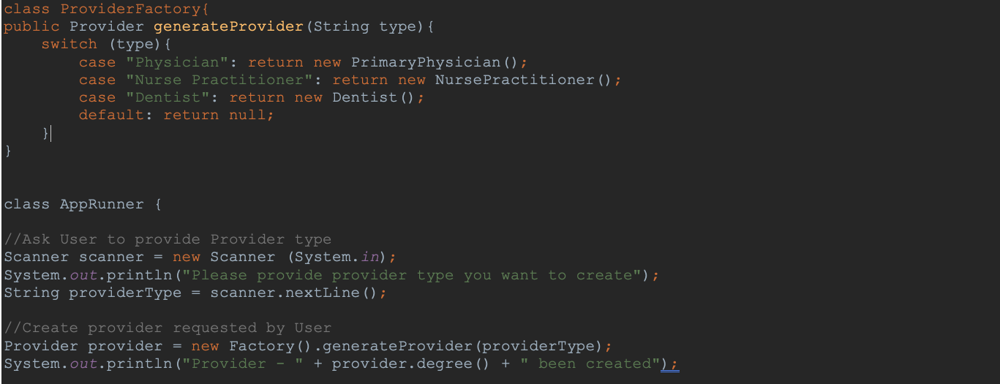

What if instead of 3 provider types we have 1000 and ant to add more?
In this case Factory method pattern gets complicated to maintain and update

## Builder

Builder – object is built peace by peace not all at once. Builder removes this logic of object construction from client code and abstracts it to separate Class.

Case: There are classes without setters, called "Immutable Classes". They are used in distributed and multi-threaded programs where multiple threads can alter the states of an object. Developers use 'synchronize' to prevent this.
Since Immutable classes does not have setters all they properties squeezed into constructor and object creation looks very ugly. Here Builder patterns comes into the picture. It allows to build object peace by peace using method chaining and hides this ugly constructor inside builder class.

1.	Abstract/Interface Builder is not required if class itself is not part of inheritance hierarchy.
      You can directly create concrete Builder
2.	Implement Builder as inner static class is a good practice
3.	But Builder as a separate class allows us to work with legacy code and libraries
4.	The Director is rarely implemented as separate class usually code client handles that role.

EXAMPLE: of Builder pattern in Java Calendar.Builder.
PITFALLS:  Created object maybe corrupted if client forgets to set some property - if will be set to null by default.

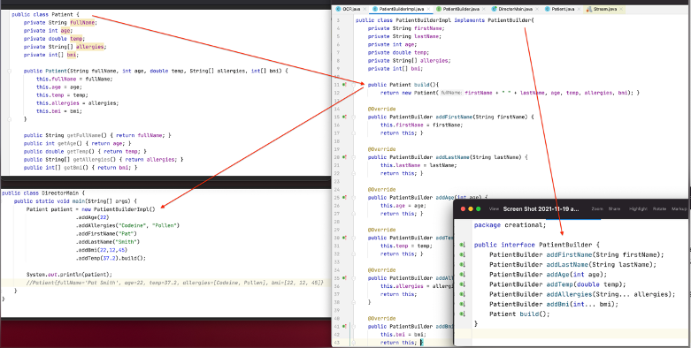

## Singleton
The singleton pattern is used to limit creation of a class to only one object. This is beneficial when one (and only one) object is needed to coordinate actions across the system.
Make the constructor ‘private’ to the class we intend to define as a singleton. That way, only the members of the class can access the private constructor and no one else.
Important: It’s possible to subclass a singleton by making the constructor protected instead of private. This might be suitable under some circumstances. One approach taken in these scenarios is to create a register of singletons of the subclasses and the getInstance method can take in a parameter or use an environment variable to return the desired singleton. The registry then maintains a mapping of string names to singleton objects, which can be accessed as needed.
### Eager singleton

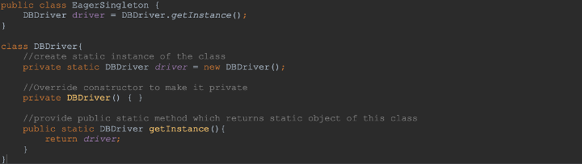

Pitfalls: our object – driver is Static which means it’s a global variable and gets initialized when class is loaded. Even if you never call this object in your code, it will take your RAM resources.
Lazy singleton

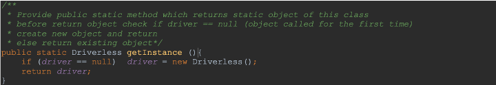

What if we have multiple threads running at the same time and calling getInstance() at the same time ?
Synchronized  getInstance()

synchronized – if one thread enters method second thread should wait until first is competed.

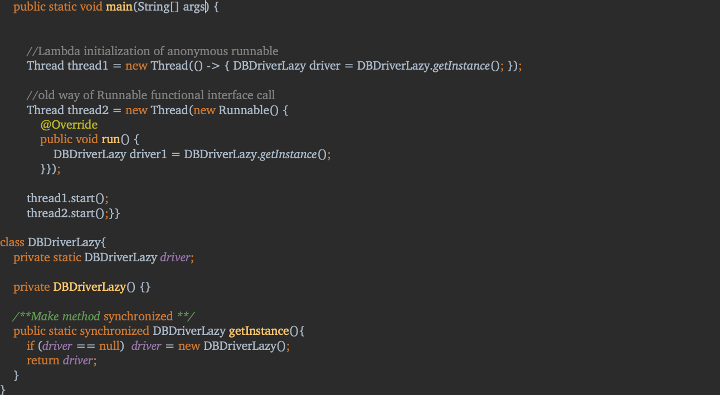

### Double check locking
What if getInstance() method is huge so each thread should wait until previous is completed?
It increases time complexity exponentially?

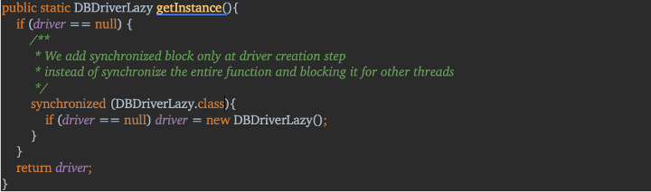

## Prototype Design Pattern
Copy an existing object rather than creating a new instance from scratch, something that may include costly operations. The existing object acts as a prototype and contains the state of the object. The newly copied object may change same properties only if required.

Prototype patterns are required, when object creation is time-consuming, and costly operation, so we create objects with the existing object itself. One of the best available ways to create an object from existing objects is the clone() method.
EXAMPLE: to create an object we first need to fetch some data from DB.

### Cloning in Java
Cloning is a process of creating an exact copy of the existing object in java heap memory. It creates a new object of the same class as the existing object and initializes all its data members using field to field mapping. The resultant object is thus called clone or copy of the original object.

In Java, only the objects of a class that implements Cloneable interface (marker interface) can be cloned or copied. clone() method of java.lang.Object can be used to achieve the desired type of copy of the object (shallow copy or deep copy).

### Shallow copy vs Deep Copy
Shallow copy - Copies primitives
Deep Copy- Reference type objects are not copied but assigned the same references as original object

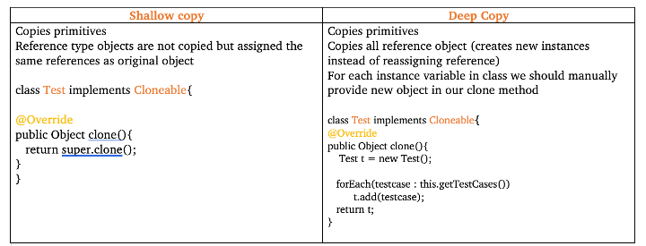
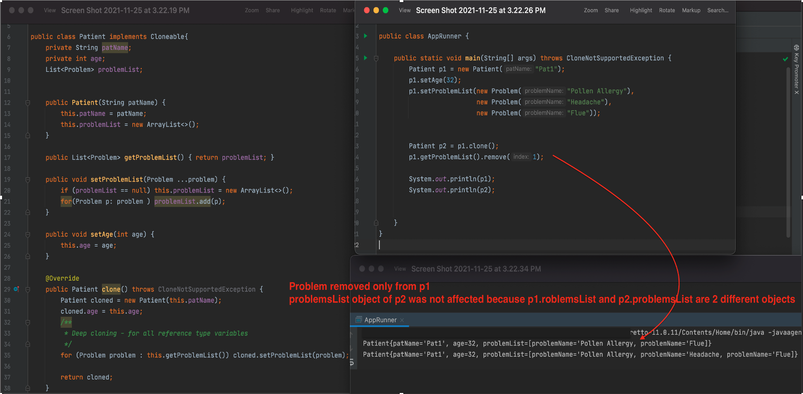

# Structural Design Patterns
## Adapter
Usage: We have an existing object which provides the functionality that client needs. But clients code can’t use this object because it expects an object with different interface.
Using adapter design pattern we can make this existing object work with client by adapting the object to clients expected interface.

Adapter (“wrapper”) converts an interface of a class into another interface that clients expect
-	Works as a bridge between two incompatible interfaces
-	Let classes work together

Example: Let’s take Two of the most commonly prescribed proton pump inhibitors (PPIs):
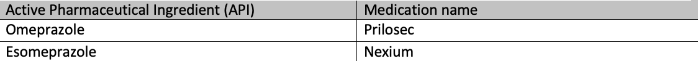

Case: Let’s say Our Providers always prescribed Prilosec with API Omeprazole but due to some changes in clinic policy been decided to switch to it’s analogy Nexium.

All our code set up to prescribe medication with Omeprazole as Active Ingredient.

So instead of updating all our code we can create and AdaperClass which will adopt new medication.   
We have class Prescription with method prescribeProtonPumpInhibitor(Omeprazole medication) it takes instance of Omeprazole class as a parameter so we cannot provide Nexium or any other medication which is does not implement Omeprazole interface

Solution: Create new class EsomeprazoleAdapter implement Omeprazole

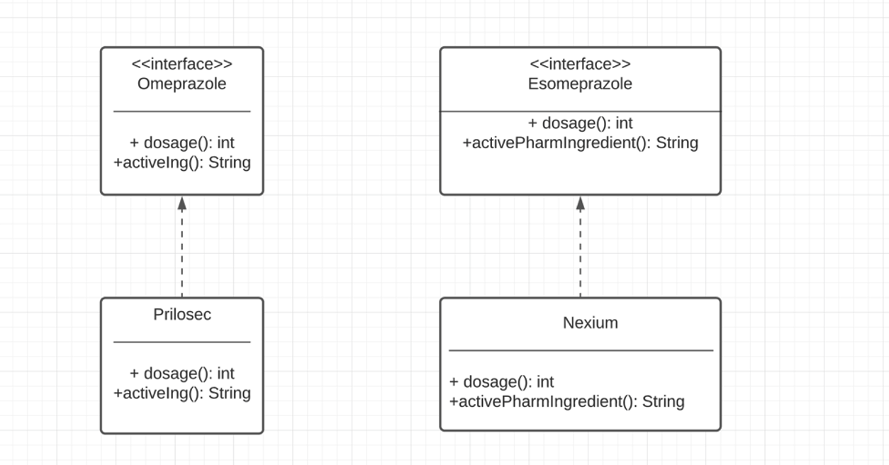

Inside of our Adapter class we create object of Class we want to provide instead Omeprazole.
Override Omeprazole functions such they call Esomeprazole functions

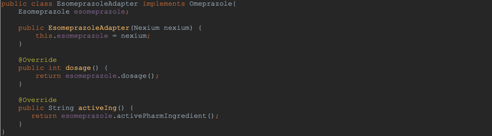

Our Prescription method can accept new  EsomeprazoleAdapter() as a parameter because EsomeprazoleAdapter class implements Omeprazole.

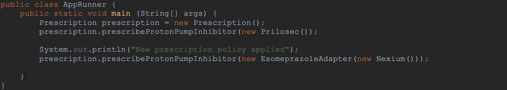

## Behavioral 
## Observer 

 The observer pattern is a software design pattern in which an object, named the subject,
 maintains a list of its dependents, called observers, and notifies them automatically of
 any state changes, usually by calling one of their methods.

 Example: FDA is a Subject, and it will notify all subscribed Pharmacies when new drug is approved
   Once the pharmacy receives notification it will either add the drug to it's list or can ignore the new drug release
   Pharmacies are allowed to unsubscribe from the FDA notification at anytime

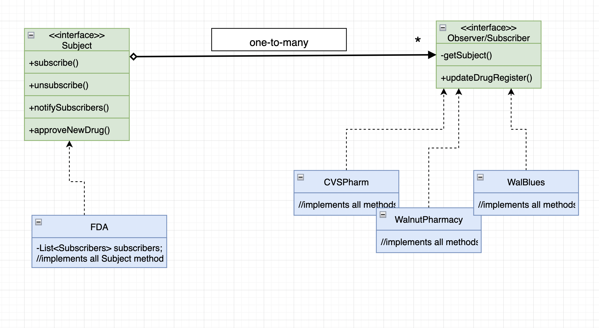

## Structural
## Facade 
Facade pattern hides the complexities of the system and provides an interface to the client using which the client can access the system.
Example: Client needs a functionality to order Medication for Patient 

## Adapter
Adapter is a structural design pattern that allows objects with incompatible interfaces to collaborate.
The Adapter pattern allows otherwise incompatible classes to work together by converting the interface of one class into an interface expected by the clients.

Example: Pharmacy discontinued Omeprazole family of drugs replacing it with Esomeprazole
         But our legacy system prescription function accepts only Omeprazole family of drugs 
         We cannot change the system and make it accept any other type of drugs 
         
`void prescribeProtonPumpInhibitor(Omeprazole medication)  ` 
Create EsomeprazoleAdapter make it implement Omeprazole interface - any object created from EsomeprazoleAdapter will be treated by our system as Omeprazole 
For EsomeprazoleAdapter class create constructor which will take Adaptee object as a parameter 
@Override all Omeprazole functions but instead of implementing new functionality simply call corresponded functions of Adaptee 

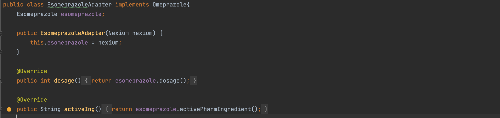

#Proxy
Proxy is a structural design pattern that lets you provide a substitute or placeholder for another object. A proxy controls access to the original object,
allowing you to perform something either before or after the request gets through to the original object.

Why would we want to control access to an object?
Example: We have a massive object that consumes a vast amount of system resources.
         Patient object - can "'HAS-A' composition" objects like: Medications, Allergies, Providers, Labs

When we want a simplified version of a complex or heavy object. In this case, we may represent it with a skeleton object which loads the original object on demand, also called as lazy initialization. This is known as the Virtual Proxy
When the original object is present in different address space, and we want to represent it locally. We can create a proxy which does all the necessary boilerplate stuff like creating and maintaining the connection, encoding, decoding, etc., while the client accesses it as it was present in their local address space. This is called the Remote Proxy
When we want to add a layer of security to the original underlying object to provide controlled access based on access rights of the client. This is called Protection Proxy

## Strategy
Strategy pattern defines a family of algorithms, encapsulate each one, 
and make them interchangeable. Strategy lets the algorithm vary independently of clients that use it.

#Bridge
#Composite
#Composition
Encapsulate what varies

 

